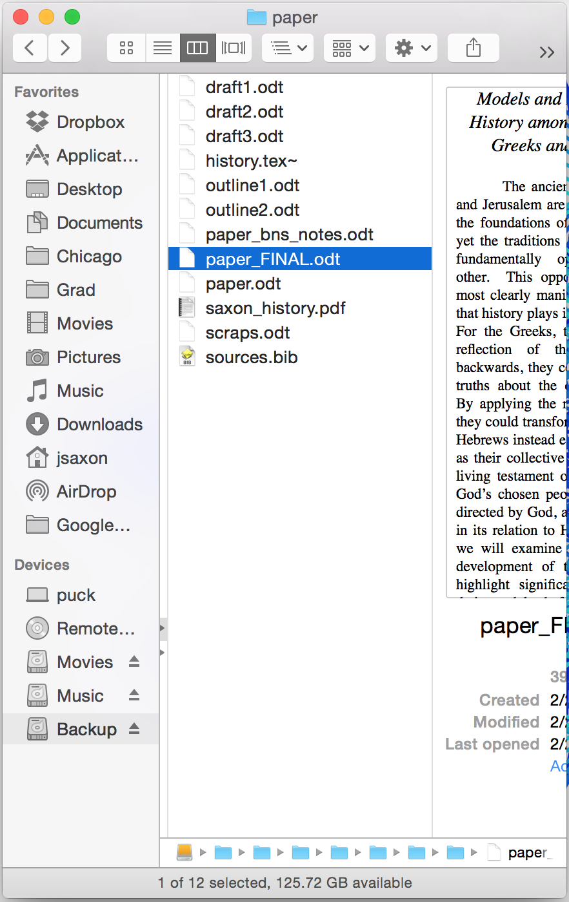
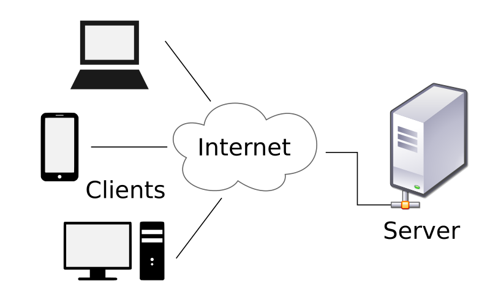
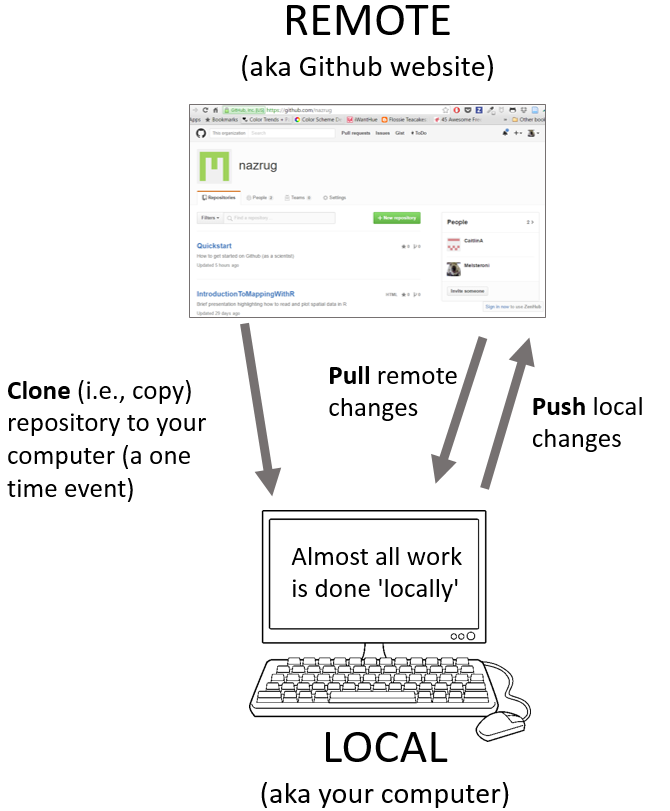

# Git

### Problem: Version control

{ height=75% }

### Problem: Collaboration

* Even worse: multiple authors, multiple documents, etc.

### Git

* *Version control systems* are software for solving this problem
* Git is _the_ modern VCS, designed by Linus Torvalds (creator of Linux)

{ height=50% }

### What does Git do?
* Manages history of files in a *repository* (folder)
* Each historical state is called a *commit*

### Sketch of local git workflow
* *Locally* the basic git workflow is:
    1. Create a repository
    2. Make changes
    3. Commit changes
    4. Return to 2.

* Additionally can view history, revert to a previous version

### Git log
{ height=75% }

### Git commands
To execute these steps we use the `git` program and its commands:

:::incremental
* `git init`: create a new repository in this directory
* `git status`: view status of all files
* `git add`: add a file to *staging* area
* `git commit`: commit staged files to history
* `git log`: show history
:::

### The .git directory
* Git stores all information about the repository and its history in the `.git` subfolder
* Files/directories that start with a `.` are *hidden*
    * They are not listed by `ls` by default
    * To see hidden files/directories use the option `-a`

### Collaboration using git
:::incremental
* In collaborative settings, git is distributed: everyone has a copy of the entire history of a repository
* It is often useful to have a central copy
    * Not just for collaboration but also for sharing and backup
* That's what GitHub is for (or GitLab or Bitbucket)
* You can think of GitHub as a "dumb" collaborator
:::

### Client-server model
* GitHub works in the classic client-server model
* This is the same model that powers the Internet and other services

{ height=50% }

### GitHub local-remote
{ height=75% }

### GitHub remote commands
* `git clone`: download a repository
* `git push`: push local
* `git pull`: pull changes (when you have collaborators also modifying the remote copy)

### GitHub URLs
* Each username/organization has a homepage on GitHub:

>        https://github.com/NAME

where `NAME` is the name of the user, e.g. `potash`, or of the organization, e.g. `harris-ippp`.

* Each repository also has a homepage on GitHub:

>        https://github.com/NAME/REPOSITORY

where `REPOSITORY` is the name of the repository.

### GitHub Assignments
* In this class you will use GitHub for assignments
* Each assignment is a GitHub repository (e.g. `s18-a01`) containing a `README.md`
* Your workflow will be:

:::incremental
1. "Accept" the assignment on GitHub
    - This will automatically create a new repository with your username appended (e.g. `s18-a01-potash`)
3. `git clone` (i.e. download) your assignment locally
4. Work on and complete your assignment
5. Submit your assignment by committing your work and pushing it back to GitHub
6. TAs will find your assignment in your repository (e.g. `s18-a01-potash`) for grading
:::
