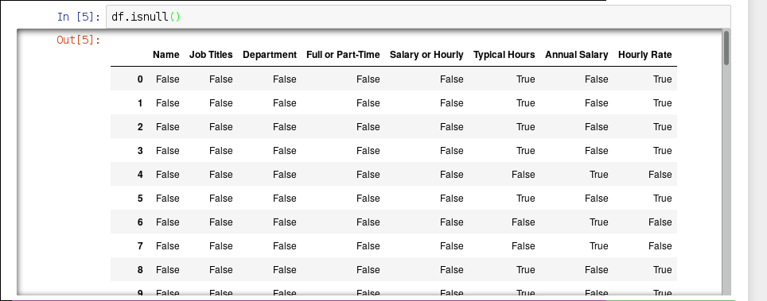
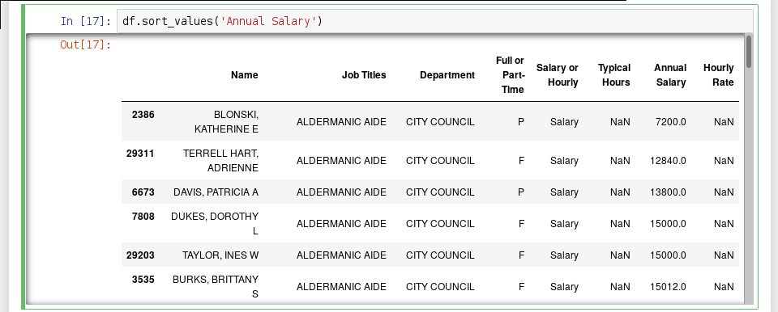
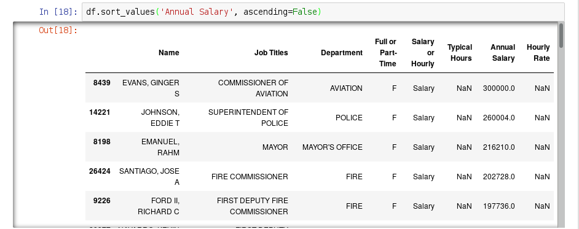
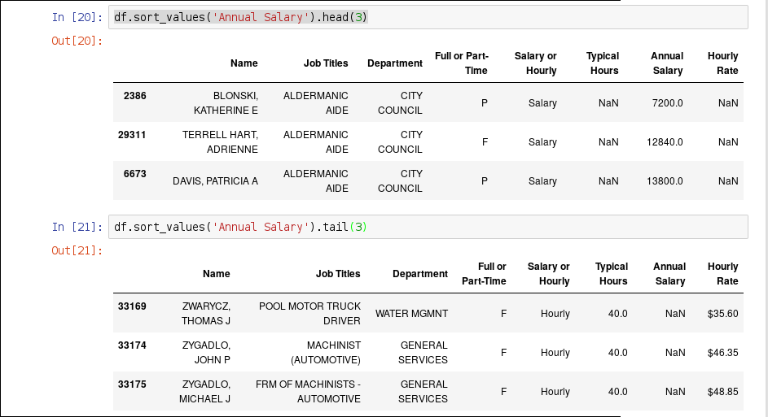
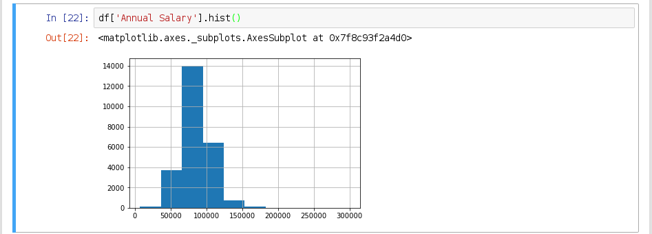

## Read a CSV

```python
>>> df = pd.read_csv('salaries.csv')
>>> df.shape
(33183, 8)
```

## Jupyter


## Columns

```python
>>> df.columns
Index(['Name', 'Job Titles', 'Department', 
       'Full or Part-Time', 'Salary or Hourly', 
       'Typical Hours', 'Annual Salary', 
       'Hourly Rate'],
      dtype='object')
```

## Data Types

```python
>>> df.dtypes
Name                  object
Job Titles            object
Department            object
Full or Part-Time     object
Salary or Hourly      object
Typical Hours        float64
Annual Salary         object
Hourly Rate           object
dtype: object
```

## `describe()`

```python
>>> df['Typical Hours'].describe()
count    8022.000000
mean       34.507604
std         9.252077
min        10.000000
25%        20.000000
50%        40.000000
75%        40.000000
max        40.000000
Name: Typical Hours, dtype: float64
```

## `mean()`

We can get just the mean:

```python
>>> df['Typical Hours'].mean()
34.507604088755919
```

## `Series.isnull()`

Again we can look at the null values:

```python
>>> df['Typical Hours'].isnull()
...
33175    False
33176     True
33177     True
33178     True
33179     True
33180     True
33181     True
33182     True
Name: Typical Hours, dtype: bool
```

Instead of summing, it can be more useful to take the mean, which corresponds to the *proportion* of missing values:

```python
>>> df['Typical Hours'].isnull().mean()
0.75824970617484855
```

## `DataFrame.isnull()`
* Similar to a Series, we can call `isnull()` on a DataFrame
* Result is now a DataFrame, with the same rows and columns, but all values are booleans indicating whether the value in the original table was null



## Missing proportions

When all columns are numeric (or boolean), we can call `mean()` on the whole DataFrame:

```python
>>> df.isnull().mean()
Name                 0.00000
Job Titles           0.00000
Department           0.00000
Full or Part-Time    0.00000
Salary or Hourly     0.00000
Typical Hours        0.75825
Annual Salary        0.24175
Hourly Rate          0.75825
dtype: float64
```

## `value_counts`

Given a series, we can get a new series which is a histogram of the original using the `value_counts` function:

```python
>>> df.Department.value_counts()
POLICE                   13414
FIRE                      4641
STREETS & SAN             2198
OEMC                      2102
WATER MGMNT               1879
AVIATION                  1629
TRANSPORTN                1140
PUBLIC LIBRARY            1015
GENERAL SERVICES           980
FAMILY & SUPPORT           615
FINANCE                    560
HEALTH                     488
CITY COUNCIL               411
LAW                        407
BUILDINGS                  269
COMMUNITY DEVELOPMENT      207
BUSINESS AFFAIRS           171
COPA                       116
BOARD OF ELECTION          107
DoIT                        99
PROCUREMENT                 92
INSPECTOR GEN               87
MAYOR'S OFFICE              85
CITY CLERK                  84
ANIMAL CONTRL               81
HUMAN RESOURCES             79
CULTURAL AFFAIRS            65
BUDGET & MGMT               46
ADMIN HEARNG                39
DISABILITIES                28
TREASURER                   22
HUMAN RELATIONS             16
BOARD OF ETHICS              8
POLICE BOARD                 2
LICENSE APPL COMM            1
Name: Department, dtype: int64
```

## Full or Part-Time

```python
>>> df['Full or Part-Time'].value_counts()
F    31090
P     2093
Name: Full or Part-Time, dtype: int64
```

## Number of detectives

```python
>>> df[df.Department == 'POLICE']['Job Titles'].value_counts()
POLICE OFFICER                                      9520
SERGEANT                                            1202
POLICE OFFICER (ASSIGNED AS DETECTIVE)               989
LIEUTENANT                                           265
POLICE OFFICER / FLD TRNG OFFICER                    231
DETENTION AIDE                                       221
POLICE ADMINISTRATIVE CLERK                          126
POLICE OFFICER (ASSIGNED AS EVIDENCE TECHNICIAN)     103
SENIOR DATA ENTRY OPERATOR                            83
COMMANDER                                             45
CLERK III                                             45
POLICE OFFICER/EXPLSV DETECT K9 HNDLR                 44
CAPTAIN                                               33
PROPERTY CUSTODIAN                                    33
POLICE OFFICER (ASGND AS MARINE OFFICER)              31
TIMEKEEPER - CPD                                      30
POLICE OFFICER (ASSIGNED AS CANINE HANDLER)           23
FREEDOM OF INFORMATION ACT OFFICER                    19
COMMUNITY ORGANIZER-CAPS                              18
POLICE OFFICER (ASGND AS MOUNTED PATROL OFFICER)      17
DEPUTY CHIEF                                          17
POLICE OFFICER (ASSIGNED AS SECURITY SPECIALIST)      16
POLICE OFFICER (ASSIGNED AS TRAFFIC SPECIALIST)       14
TRAINING OFFICER                                      13
PERSONAL COMPUTER OPERATOR I                          12
ADMINISTRATIVE ASST II                                11
EXPLOSIVES TECHNICIAN I                               11
POLICE TECHNICIAN                                     10
POLICE OFFICER(ASGND AS LATENT PRINT EX)               9
DATA ENTRY OPERATOR                                    9
```


## Type conversion

:::incremental
* We could prefer to store full or part time status as a boolean.

    ```python
    >>> df['Full-time'] = df['Full or Part-Time'] == 'F'
    ```

    How can we subset to the full-time emplyees?

* 
    ```python
    >>> df[df['Full-time']]
    ```

    How can we subset to part-time employees?

* 
    ```python
    >>> df[~df['Full-time']]
    ```
:::

## `apply`

A very powerful tool for extending pandas is `apply`. This produces a new series by calling a function on each element in an existing series.

```python
>>> df['Typical Hours'].apply(np.sqrt)
...
33168    4.472136
33169    6.324555
33170         NaN
33171         NaN
33172         NaN
33173         NaN
33174    6.324555
33175    6.324555
33176         NaN
33177         NaN
33178         NaN
33179         NaN
33180         NaN
33181         NaN
33182         NaN
Name: Typical Hours, dtype: float64
```

## More interesting example

```python
def get_first_name(name):
    first_middle = name.split(',  ')[1]
    first = first_middle.split(' ')[0]
    
    return first
```

```python
>>> df.Name.apply(get_first_name)
...
33176          ARTUR
33177          DAWID
33178      KATARZYNA
33179          LAURA
33180           MARK
33181          CARLO
33182        DARIUSZ
Name: Name, Length: 33183, dtype: object
```

## Count first names

```python
>>> df['First Name'] = df.Name.apply(get_first_name)
>>> df['First Name'].value_counts()
MICHAEL        1151
JOHN            856
JAMES           645
ROBERT          587
JOSEPH          540
DAVID           511
DANIEL          510
THOMAS          471
ANTHONY         411
WILLIAM         376
KEVIN           354
...
```


## String columns

Another way to work with string columns is through the `.str` attribute. For example:

```python
>>> (df['Job Titles'].str.find('DETECTIVE') >= 0)
0        False
1         True
2        False
3        False
4        False
5        False
6        False
7        False
8        False
9        False
...
```

```python
>>> (df['Job Titles'].str.find('DETECTIVE') > 0).sum()
989
```

## Salaries
Also use the `.str` attribute to help parse the salaries.

:::incremental
* First by dropping the first character:

    ```python
    >>> df['Annual Salary'].str[1:]
    ...
    33180     90024.00
    33181     93354.00
    33182    115932.00
    Name: Annual Salary, dtype: object
    ```

* Next by converting to float using the `astype` method:

    ```python
    >>> df['Annual Salary'].str[1:].astype(float)
    ...
    33180     90024.0
    33181     93354.0
    33182    115932.0
    Name: Annual Salary, dtype: float64
    ```
:::

## Salaries continues

* Replace the original column with the numeric conversion:

    ```python
    >>> df['Annual Salary'] = \
    ...     df['Annual Salary'].str[1:].astype(float)
    ``` 

* Now can get descriptive statistics:

    ```python
    >>> df['Annual Salary'].describe()
    count     25161.000000
    mean      86786.999790
    std       21041.354602
    min        7200.000000
    25%       76266.000000
    50%       90024.000000
    75%       96060.000000
    max      300000.000000
    Name: Annual Salary, dtype: float64
    ```

## `sort_values`

Now that salaries are numeric, we can meaningfully sort the table by them:



## `sort_values(ascending=False)`



## `head` and `tail`



## `Series.hist()`


