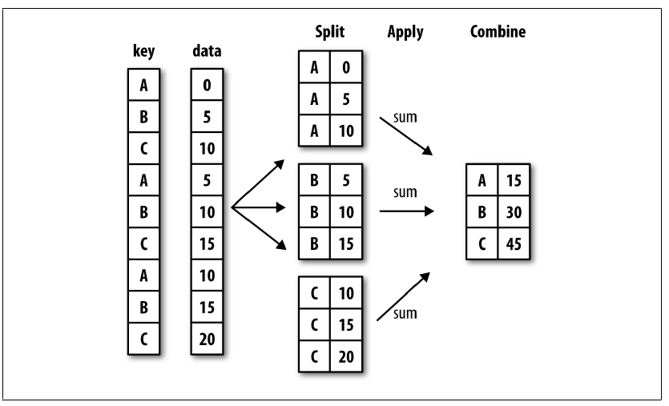

# Aggregation

## Overview

* A common data analysis task is to create pivot tables or other group level summary statistics.
* This is done using pandas' `groupby` function

## Split-apply-combine

* The basic workflow for `groupby` operations is called *split-apply-combine*:
    * First the data (e.g. a DataFrame) is *split* into groups
    * Next a function is *applied* to each group
    * Finally the results from all groups are *combined*

## Split-apply-combine diagram



## `value_counts()`
* In fact, `Series.value_counts()` can be thought of as a group aggregation:
    * first, the series is split into groups of each value
    * Next each group's size is calculated
    * Finally, they are re-assembled into a new series with index the group's value and value the group's size

## `size()`
The `groupby` function generalizes this. We can recreate value counts like this:

```python
>>> s = pd.Series(['red','green','blue','green',
                   'blue','green'])
>>> s.groupby(s).size()

blue     2
green    3
red      1
dtype: int64
```

More generally, we can group by one series to aggregate a different one.

## `sum()`
```python
>>> s = pd.Series(['red','green','blue','green',
                   'blue','green'])
>>> t = pd.Series([3, 4, 5, 7, 1, 2])
>>> t.groupby(s).sum()
blue      6
green    13
red       3
dtype: int64
```

* Note that this requires the Series to be of the same size and same index.
* What data structure do we use for storing multiple series of the same size and index?


## DataFrame
A DataFrame is ideal for `groupby` operations:

```python
>>> df = pd.DataFrame({
...     'color': ['red','green','blue','green',
...               'blue','green'],
...     'value': [3, 4, 5, 7, 1, 2],
...     'number': [1.5, 2.5, 3.5, 4, 5.5, 6]
... })
>>> df['value'].groupby(df['color']).sum()
color
blue      6
green    13
red       3
Name: value, dtype: int64
```

## `GroupBy` object
The intermediate result of `groupby()` is of the special type `GroupBy`:

```python
>>> df = pd.DataFrame({
...     'color': ['red','green','blue','green',
                  'blue','green'],
...     'value': [3, 4, 5, 7, 1, 2],
...     'number': [1.5, 2.5, 3.5, 4, 5.5, 6]
... })
>>> gb = df['value'].groupby(df['color'])
>>> gb
<pandas.core.groupby.SeriesGroupBy object at 0x7f30673c3210>
```

Here we are calling `groupby` on the Series `df['value']`. We can also call it on the DataFrame `df` itself.

## Column names
When grouping a DataFrame, you can pass the name of the column instead of a Series:

```python
>>> gb = df.groupby('color')
>>> gb
<pandas.core.groupby.DataFrameGroupBy object at 0x7f30673c3210>
```
Now calling `sum()` will aggregate all remaining columns returning a `DataFrame`:
```python
>>> gb.sum()
       number  value
color               
blue      9.0      6
green    12.5     13
red       1.5      3
```

Note that since `size()` does not depend on the column, it will still return a single Series.

## Selecting a column
With a DataFrame you can select a column to aggregate:

```python
>>> gb['value'].sum()
color
blue      6
green    13
red       3
Name: value, dtype: int64
```


## Iterating over groups

We can iterate over the groups in the groupby object:

```python
>>> for k, group in df.groupby('color'):
...     print(k)
...     print(group, '\n')
blue
  color  number  value
2  blue     3.5      5
4  blue     5.5      1
green
   color  number  value
1  green     2.5      4
3  green     4.0      7
5  green     6.0      2
red
  color  number  value
0   red     1.5      3
```

## More functions
```python
>>> df.groupby('color')['value'].mean()
color
blue     3.000000
green    4.333333
red      3.000000
Name: value, dtype: float64
```

```python
>>> df.groupby('color').median()
       number  value
color               
blue      4.5      3
green     4.0      4
red       1.5      3
```

More functions to look up: `std`, `var`, `quantile`, `min`, `max`, etc.

## Multiple functions using `agg()`
You can perform aggregate using multiple functions simultaneously using `agg()`:

```python
>>> gb = salaries.groupby('Department')['Annual Salary']
>>> gb.agg(['mean', 'size'])
                           mean  size
Department                           
ADMIN HEARNG       78683.692308    39
ANIMAL CONTRL      66197.612903    81
AVIATION           78750.549324  1629
BOARD OF ELECTION  53548.149533   107
BOARD OF ETHICS    95061.000000     8
BUDGET & MGMT      91836.545455    46
BUILDINGS          99246.761041   269
BUSINESS AFFAIRS   80577.073171   171
CITY CLERK         70899.392857    84
CITY COUNCIL       64482.566801   411
...
```

GroupBy's `agg` function takes a list of aggregation names and returns a `DataFrame`. You can also pass functions to agg, e.g. `agg(np.sqrt)`.

## Multiple keys
You can also group by *multiple* keys:
```python
>>> salaries.groupby(['Department', 'Job Titles'])\
            .size()
...
WATER MGMNT   CONSTRUCTION LABORER               431
OEMC          CROSSING GUARD                     451
FIRE          FIREFIGHTER                        487
STREETS & SAN POOL MOTOR TRUCK DRIVER            497
              SANITATION LABORER                 625
POLICE        POLICE OFFICER (ASSNED DETECTIVE)  989
              SERGEANT                          1202
FIRE          FIREFIGHTER-EMT                   1473
POLICE        POLICE OFFICER                    9520
dtype: int64
```

This extends the `value_counts` to multiple columns.

# Transformation

## Overview

* In a group aggregation procedure, each group is reduced to a single row in the result
* Sometimes you want to perform a group operation that still produces one row for each row in the source data
* For this we use `transform` instead of `agg`

## Group mean
* For example, to de-mean each employee's salary within their department:
    * Split into department groups
    * Subtract the mean from each row in the group
    * Concatenate the groups together
* The result has the same number of rows as the original data

## De-mean code

```python
def demean(s)
   return s - s.mean()
```

```python
>>> gb =  salaries.groupby('Department')
>>> salaries['Annual Salary Demeaned'] =\
        gb['Annual Salary'].transform(demean)
>>> salaries[['Annual Salary', 'Annual Salary Demeaned']]
   Annual Salary  Annual Salary Demeaned
0       101442.0            14955.585497
1        94122.0             7635.585497
2       101592.0            18046.942884
3       110064.0            20220.298361
4            NaN                     NaN
5        50436.0           -14046.566801
...
```
