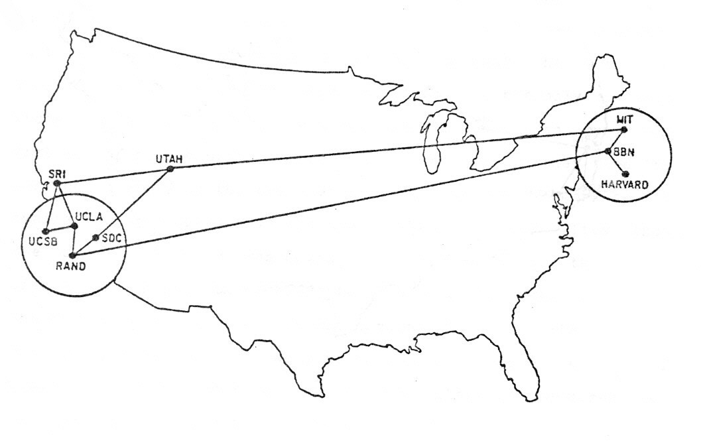
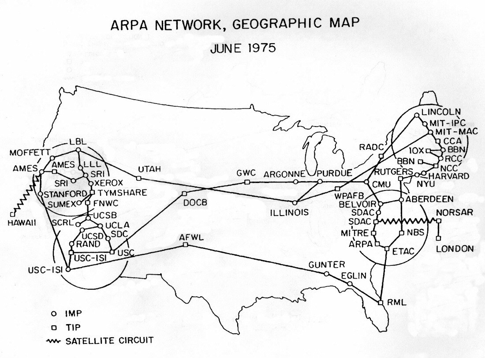
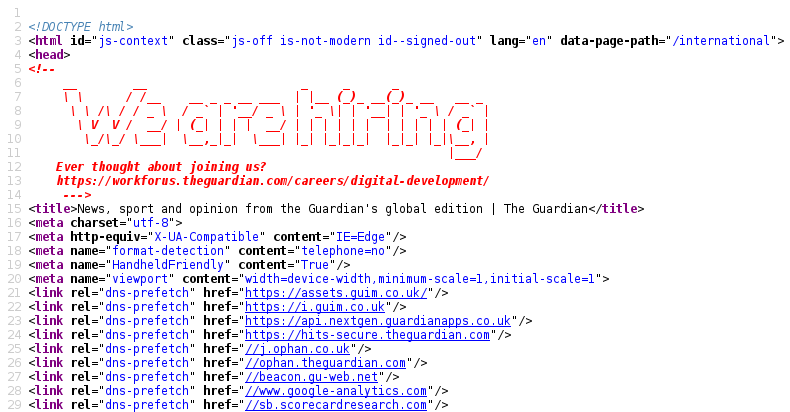
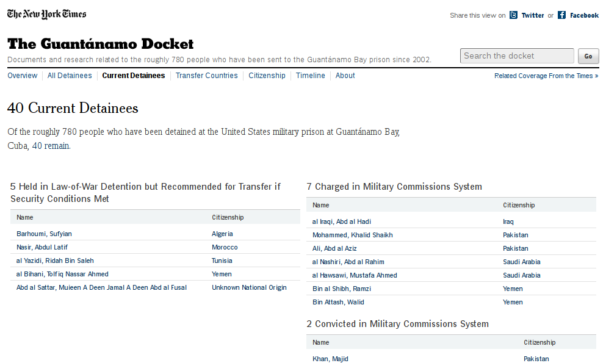
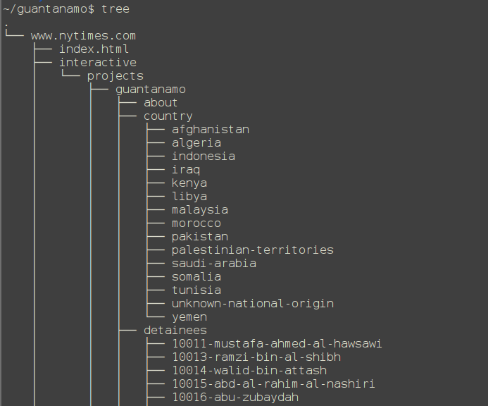

# The Internet

## The Internet and World Wide Web

* The **Internet** is a *physical network* of cables and routers, and a set of protocols for moving information across that network.

* The **World Wide Web** (WWW) is an *information space* on the Internet. It combines several concepts:

    * Uniform Resource Locator (url)
    * Hypertext Transfer Protocol (http)
    * Hypertext Markup Language (html)

## The Internet

* Started as a Defense Advanced Research Projects Agency (DARPA) ARPANET project to interconnect computers
* First transmission between nodes at UCLA in 1969; by 1970 reached across the US to Boston.
* Transmission Protocol/Internet Protocol (TCP/IP) developed during the 1970s
* ARPANET declared "operational" in 1975 and transferred to military
* Ethernet (transmission on wires) standard written 1981
* During 1980s, shift to National Science Foundation
    * NSFNET provided the backbone of Internet from 1985 to 1995
* Internet backbone privatized under Clinton in 1994

## 


## 


##


##


## Uniform Resource Locator

URLs are a system of globally unique identifiers for resources on the Web and elsewhere.

```
scheme://host[:port]/path[?query][#fragment]
```

* `scheme` is a protcol such as `http`, `https`, etc.
* `host` is something like `google.com` or `localhost`
* `:port` is optional, allows a single host to have separate websites
* `path` is the path to a particular resource like `index.html`
* More on queries later

# Hypertext Transfer Protocol (HTTP)

## HTTP Overview

* HTTP is the core communications protocol for retrieving data
* Consists of messages-- requests and responses-- sent between a client and a server


## HTTP Request

```html
GET /index.html HTTP/1.1
User-Agent: Mozilla/5.0
...
```

* First line contains:
    * HTTP method, here `GET`
    * Requested URL
    * HTTP version
* Rest of request may contain:
    * User-Agent: description of the client
        * Used e.g. to determine whether to serve mobile website version

## HTTP Methods
* `GET`
    * Most common method, used to get data
* `POST`
    * Used to send data to server, e.g. form entries, search queries

## HTTP Responses

```html
HTTP/1.1 200 OK
...
```

* First line contains:
    * HTTP version
    * HTTP response code
* Rest of response contains:
    * Additional headers: `Server`, `Content-Type`, etc.
    * Requested Content

## HTTP Response Codes

* 1xx: Informational
* 2xx: Success
    * 200: OK
* 3xx: Redirection
    * 301: Redirect
* 4xx: Errors
    * 404: File not found
    * 403: Forbidden

## HTTP GET Request Parameters

```
/index.php?name1=value1&name2=value2
```

* Query string with parameters sent in the URL of a GET request
* Parameter names and values are like a python dictionary
* Shouldn't use with sensitive data


# Hypertext Markup Language (HTML)

## Web browser 


## HTML sourcecode




## HTML overview

* Language that webpages are written in
* Consists of *tags*
* Most tags come in pairs (opening and closing):
    * `<html></html>`
    * `<head></head>`
    * `<body></body>`
    * `<a></a>`
* Some do not:
    * ``
    * `<br>`
* Whitespace doesn't matter (unlike Python)

## Basic HTML webpage

```html
<html>

<head>
    <title>My Title</title>
</head>

<body>
<h1>My Site</h1>
<p>
More information <a href="main.html">here</a>.
</p>

</body>
</html>
```

## Basic webpage

 

## HTML links

```
<a href="main.html">here</a>
```

* `a` is the tag
* `here` is the content
* `href` is an attribute whose value is `main.html`
    * attributes and their values form something like a dictionary


## More HTML tags

* `<title>`: page title
* `<body>`: page body
* `<h1>`: largest header
* `<h6>`: smallest header
* `<p>`, `<br>`: paragraph, break
* `<em>`, `<b>`: emphasis (italics), bold
* `<ol>`, `<ul>`, `<li>`: (Un-)ordered list, list element
* `<a href="">`: Hyperlink
* `<table>`, `<tr>`, `<th>`, `<td>`: table row, header, and cell
* ``: image
* `<div>`: block

## HTML table

```html
<table>
  <tr>
    <td>Header 1</td>
    <td>Header 2</td>
  </tr>
  <tr>
    <td>Data 1</td>
    <td>Data 2</td>
  </tr>
</table>
```


## Other web technologies

* Javascript
    * `.js` files sourced or code directly embedded in `<script>...</script>` tags
    * Used to make content dynamic
* CSS
    * `.css` files or code embedded in `<style></style>` tags
* Server-side languages
    * Ruby, PHP, Python (Django), Java, etc.

# Web Scraping

## Web scraping overview

* Scraping is the process of programmatically extracting information from websites

* Anything that you can view in a web browser can *potentially* be scraped

## Why scrape?

Some websites offer services (APIs) that allow you to get data directly. So why scrape?

* Not all websites provide an API
* Not all of a website's content is available through its API
* APIs often use tokens to limit the amount of data that can be requested
    * With scraping there is, in principle, no limit

## When to scrape?

Scraping is good for:

* Downloading all `.mp3` files linked from a site
* Constructing a pandas DataFrame from a table on Wikipedia
* Parsing articles from a small news website

Scraping is not ideal for:

* Extracting information from your emails (python has POP/IMAP libraries)
* Analyzing tweets (Twitter provides an API)

## Ethical considerations

* Credit all sources
    * Publishing scraped content can be a copyright violation
* Don't overload websites
    * Most sites will block you before you can do this
* Obey `robots.txt`
    * Most sites have a file describing which areas of the site are prohibited from being scraped
* You are not anonymous on the web
    * Unless you take explicit steps (VPN, Tor, etc.) to do so

## Scraping from the command line

* We already saw one basic way to scrape using the command line program `curl`:

    ```bash
    $ curl https://data.cityofchicago.org/api/views/xzkq-xp2w/rows.csv
      -o salaries.csv
    ```

* There's a similar program called `wget`:

    ```bash
    $ wget https://data.cityofchicago.org/api/views/xzkq-xp2w/rows.csv
    ```

* The advantage of `wget` is that it can follow links and download them, too

## Example site to scrape



[https://www.nytimes.com/interactive/projects/guantanamo/detainees/current](https://www.nytimes.com/interactive/projects/guantanamo/detainees/current)

## Subpage


## Recursive `wget`

```bash
$ wget -r -l 1 https://www.nytimes.com/interactive/projects/guantanamo/detainees/current
...
2018-05-07 23:18:40 (8.70 MB/s) - ‘www.nytimes.com/interactive/projects/guantanamo/detainees/27-uthman-abdul-rahim-mohammed-uthman’ saved [11992/11992]

FINISHED --2018-05-07 23:18:40--
Total wall clock time: 1.0s
Downloaded: 66 files, 1.3M in 0.09s (14.3 MB/s)
```

## Recursive `wget` results

