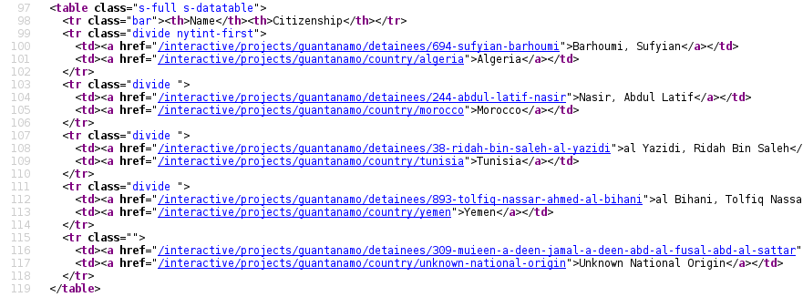
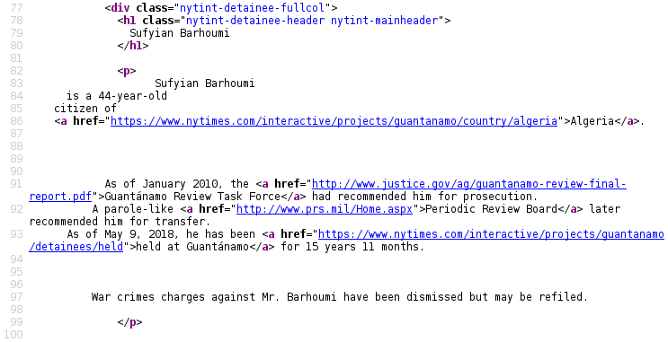
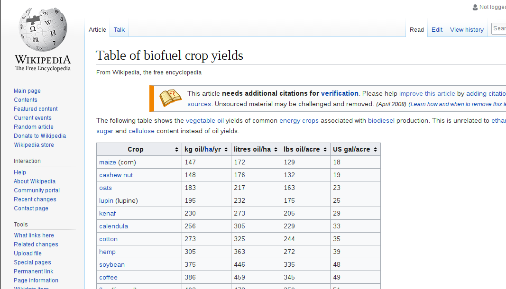

# Web Resources

## Variety

* There's a variety of information on the web:
    * *Unstructured* text
    * Tables
    * "Hidden" APIs
    * Documented APIs

## Examples of Web Resources

1. Google has many straightforward [APIs for mapping](https://developers.google.com/maps/documentation/directions/intro).
2. Twitter provides a well-known [API](https://developer.twitter.com/en/docs) that is used heavily by researchers.
3. U.S. Census provides a [data website](https://www.census.gov/data.html) and [APIs](https://www.census.gov/data/developers/data-sets/acs-5year.html).
4. Bureau of Labor Statistics has an [API](https://www.bls.gov/developers/).
6. Lots of Wikipedia articles have nice tables
7. Some websites go to great lengths to keep you out, e.g. [Google Trends](https://trends.google.com)

## Tools

1. `requests`: Python module for retrieving web resources
    * Basic methods for authentication, `POST`ing, etc.
    * Basically `curl`/`wget` for Python

2. `beautifulsoup`: Python module for traversing and extracting elements from a web page.

3. `pandas.read_html()`: reads a well-formatted html table into a pandas DataFrame.

4. `selenium` is similar but actually launches a web browser like Firefox
    * Works with JavaScript heavy pages

5. Command line tools (`curl`, `wget`)

# Scraping

## What is scraping?

* Look at HTML and individual requests (e.g. using developers tools in your browser)
* Identify patterns in HTML and URLs that allow you to download the right resources
* Extract data from those resources
* Relatively ad-hoc, need to write new scraping tools for each (part of each) site

## Requests

```python
import requests

base = 'https://www.nytimes.com'
path = '/interactive/projects/guantanamo/detainees/current'

response = requests.get(base + path)
```

## Responses

```python
>>> type(response)
requests.models.Response
>>> response.status_code
200
>>> print(response.text)
<!DOCTYPE html>
<html xmlns="http://www.w3.org/1999/xhtml" xml:lang="en" lang="en">
  <head>
    <meta http-equiv="Content-Type" content="text/html; charset=utf-8"/>
    <meta name="viewport" content="width=device-width, user-scalable=no">
    <title>The Detainees - The Guant&aacute;namo Docket</title>
    <meta name="hdl" content="The Detainees - The Guant&aacute;namo Docket
...
```

## Identify

The first step in scraping is figuring out a way to identify the information you want.




## Parsing HTML

* You could manually search for `response.text` for 
```
<a href="/interactive/projects/gauntanamo/detainees/...
```

* Then, to get the detainee's name you'd need to find the next `>` and the closing tag `</a>` and extract the text in between.

* This would be cumbersome

## Beautiful Soup

* The Beautiful Soup library makes this much easier by converting the text into a data structure that is easy to "traverse"

```python
>>> from bs4 import BeautifulSoup
>>> page = BeautifulSoup(response.text, 'html.parser')
>>> type(page)
bs4.BeautifulSoup
```

## `find all()`
Use the `find_all()` function to find all tags of a paticular type:
```python
>>> page.find_all('a')
[<a href="http://www.nytimes.com" target="_blank"></a>,
 <a class="nytint-sharetoolsShareLink nytint-sharetoolsShareLinkTwitter nytint-shareViewToolsLink" href="#" id="nytint-shareViewToolsLinkTwitter" target="_blank">Twitter</a>,
 <a class="nytint-sharetoolsShareLink nytint-sharetoolsShareLinkFacebook nytint-shareViewToolsLink" href="#" id="nytint-shareViewToolsLinkFacebook" target="_blank">Facebook</a>,
 <a href="https://www.nytimes.com/interactive/projects/guantanamo">
 
 </a>,
 <a href="http://www.nytimes.com/guantanamo-files">Related Coverage From the Times »</a>,
 <a href="https://www.nytimes.com/interactive/projects/guantanamo">Overview</a>,
...
```

## `Tag`

* Each element in the list returned by `find_all()` is a special `Element` data type:

    ```python
    >>> a = page.find_all('a')[0]
    >>> type(a)
    bs4.element.Tag
    ```

* You can see its HTML by simply printing it:

    ```python
    >>> a
    <a href="http://www.nytimes.com" target="_blank"></a>
    ```

## `Tag` details
* You can see a dictionary of its attributes:

    ```python
    >>> a.attrs
    {'href': 'http://www.nytimes.com', 
     'target': '_blank'}
    ```

* You can see its contents:

    ```python
    >>> a.contents
    []
    >>> a.text
    ''
    ```

## Detainee links

* But we only want the detainee links
* These can be identified as having an `href` that starts with `'/interactive/projects/guantanamo/detainees'`
* So one way to get them would be:

```python
detainee_links = []
prefix = '/interactive/projects/guantanamo/detainees'
for a in page.find_all('a'):
    if a.attrs['href'].startswith(prefix):
        detainee_links.append(a)
```

## Issues

```python
>>> detainee_links
[<a href="/interactive/projects/guantanamo/detainees/current">Current Detainees</a>,
 <a href="/interactive/projects/guantanamo/detainees/694-sufyian-barhoumi">Barhoumi, Sufyian</a>,
 <a href="/interactive/projects/guantanamo/detainees/244-abdul-latif-nasir">Nasir, Abdul Latif</a>,
 <a href="/interactive/projects/guantanamo/detainees/38-ridah-bin-saleh-al-yazidi">al Yazidi, Ridah Bin Saleh</a>,
 <a href="/interactive/projects/guantanamo/detainees/893-tolfiq-nassar-ahmed-al-bihani">al Bihani, Tolfiq Nassar Ahmed</a>,
...
```

* This includes the links to `detainees/current` and `detainees/country`
* We could manually remove them but there's a better way

## Regex

* Regular expressions are a language for expressing patterns that can be matched to text
* For example the regular expression `\d` matches any numeric digit
* The regular expression `detainees/\d` matches `detainees/\d` followed by a digit

## Python `re`

The `re` module provide regular expression matching in Python:

```python
>>> import re
>>> pattern = re.compile('d+')
>>> type(pattern)
_sre.SRE_Pattern
>>> pattern.find_all('1')
['1']
>>> pattern.find_all('abc')
[]
>>> pattern.find_all('Chicago, IL 60637')
['6', '0', '6', '3', '7']
```

## More regex

TODO: Or
TODO: Grouping
TODO: Quantification


## Regex `find_all()`

The `BeatifulSoup.find_all()` function can filter an attribute to match a regular expression:

```
page.find_all('a', href=re.compile('detainees/\d'))
```

## Print prisoner names

```python
import requests

base = 'https://www.nytimes.com'
path = '/interactive/projects/guantanamo/detainees/current'

response = requests.get(base + path)
path = BeautifulSoup(response.text, 'html.parser')

detainee_links = page.find_all('a', href=re.compile('detainees/\d'))

for a in detainee_links
    print(a.text)
```

## Country

* After each prisoner link in the HTML there is a link to their country.
* We can scrape this, too like so:

```python
>>> a
<a href="/interactive/projects/guantanamo/detainees/694-sufyian-barhoumi">Barhoumi, Sufyian</a>
>>> a.find_next('a')
<a href="/interactive/projects/guantanamo/country/algeria">Algeria</a>
>>> a.find_next('a').text
'Algeria'
```

## More information

* What if we want to get more information about each detainee?
    * For example, how long they've been detained
* We'll need to requst each detainee's page and scrape that:

```python
>>> detainee_path = detainee_links[0].attrs['href']
>>> detainee_path
'/interactive/projects/guantanamo/detainees/694-sufyian-barhoumi'
>>> detainee_page = requests.get(base + detainee_path)
```

## Detainee HTML



## Extract time detained

:::incremental
*

    ```python
    >>> time_pattern = re.compile('\d+ year')
    >>> time_pattern.findall(detainee_div.text)
    ['15 year']
    ```
    
    How can we get the number 15?

*

    ```python
    >>> matches = time_pattern.findall(detainee_div.text)
    >>> int(matches[0].rstrip(' year'))
    15
    ```
:::

## Put it in a function

```python
time_pattern = re.compile('\d+ year')

def get_years(det_page):
    div = det_page.find('div', 
                        class_='nytint-detainee-fullcol')
    matches = time_pattern.findall(div.text)
    return int(matches[0].rstrip(' year'))
```

## Another function
```python
def get_detainee_page(detainee_link):
    detainee_response = requests.get(
            base + detainee_link.attrs['href'])
    
    return BeautifulSoup(detainee_response.text, 
                         'html.parser')
```

## Putting it together
```python
import time

names, countries, years = [], [], []

for a in detainee_links:
    print(a.text)
    names.append(a.text)
    countries.append(a.find_next('a').text)

    detainee_page = get_detainee_page(a)
    years.append(get_years(detainee_page))

    time.sleep(2)

detainees = pd.DataFrame({'name': names,
                          'country': countries,
                          'years': years})
```

# Pandas `read_html()`

## HTML Table



## `pd.read_html()`
TODO
