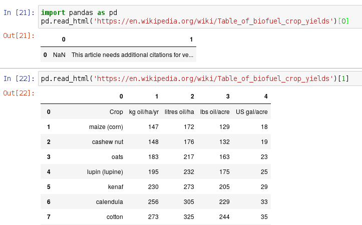
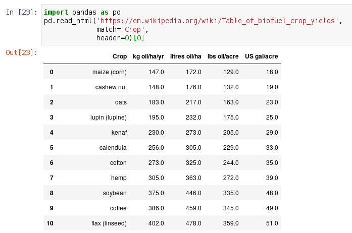

# Missing Values

## None
* `None` is the most basic missing value in python
* It's the default return value from functions that don't `return`:

    ```python
    >>> def test(): print('Hello, World')
    >>> r = test()
    >>> print(r)
    None
    ```

## `is`

Python has another comparison operator `is`:
```python
>>> a, b, c = 1, 2, 1
>>> a is b
False
>>> a is c
True
```

* Same as `==` on "primitive" types (numbers, booleans, strings)
* Commonly used in the expression `is None` or `is not None`
    * Equivalent to `== None` or `!= None` but more readable

## `is`
For objects like lists and dictionaries `is` is not equivalent to `==`:

```python
>>> a, b, c = [1], [2], [1]
>>> a is b
False
>>> a is c
False
```

For complex objects `is` is only True if the variables reference to the same data:

```python
>>> a = [1]
>>> c = a
>>> a is c
True
```

## `NaN` and `NaT`
* `nan`/`NaN`: provided by NumPy/pandas for missing floats (use `np.nan`)
    * Pandas automatically converts `None` to `nan` (which it calls `NaN`):

        ```python
        >>> pd.Series([1,None,3])
        0    1.0
        1    NaN
        2    3.0
        dtype: float64
        ```
* `NaT`: provided by pandas for missing Timestamps (use `pd.NaT`)

## Comparing missing values

`NaN` and `NaT` can be used in comparisons but are always `False`

* `np.nan < x` is False regardless of what `x` is
    * Same with `>`, `<=`, `>=`, and `==`
    * So `np.nan == np.nan` is `False`; but so is `np.nan != np.nan`
    * (R is better about this: `NA > 0` is itself `NA`
* Same is true of `pd.NaT`

## Consequences

```python
>>> s = pd.Series([1,None,3])
>>> (s > 2).mean()
0.33333333333333331
>>> (s <= 2).mean()
0.33333333333333331
```

## Arithmetic with missing values

Any arithmetic with `nan` results in `nan`:

```python
>>> 1 + np.nan
nan
>>> np.nan * 2
nan
>>> 1/np.nan
nan
```

Pandas does better, ignoring `nan`s in aggregation:

```python
>>> s = pd.Series([0,None,2])
>>> s.mean()
1.0
>>> s.sum()
2.0
```

# Error handling

## Guantanamo code

```python
def get_years(det_page):
    """
    Given detainee page get years detained
    """
    div = det_page.find('div', 
                        class_='nytint-detainee-fullcol')
    matches = time_pattern.findall(div.text)
    return int(matches[0].rstrip(' year'))
```

What happens if there is no `div` of class `nytint-detainee-fullcol` on the detainee page?

## Guantanamo code: raise an error

```python
def get_years(det_page):
    """
    Given detainee page get years detained
    """
    div = det_page.find('div', 
                        class_='nytint-detainee-fullcol')

    if div is None:
        raise ValueError("No detainee div found")
    else:
        matches = time_pattern.findall(div.text)
        return int(matches[0].rstrip(' year'))
```

## Guantanamo code: ignore error

```python
def get_years(det_page):
    """
    Given detainee page get years detained
    """
    div = det_page.find('div', 
                        class_='nytint-detainee-fullcol')

    if div is None:
        return None
    else:
        matches = time_pattern.findall(div.text)
        return int(matches[0].rstrip(' year'))
```

## Guantanamo code: ignore error revised

```python
def get_years(det_page):
    """
    Given detainee page get years detained
    """
    div = det_page.find('div', 
                        class_='nytint-detainee-fullcol')

    if div is not None:
        matches = time_pattern.findall(div.text)
        return int(matches[0].rstrip(' year'))
```

# Pandas [`read_html()`](https://pandas.pydata.org/pandas-docs/stable/generated/pandas.read_html.html)

## HTML Table


## `read_html()`



## `read_html()` arguments



# APIs

## API Overview

* Application Programming Interfaces (APIs) are web-based resources that serve data directly

* Typically in `json`, `csv`, or `xml` format

* You can access them with `requests` in python or `curl`

* The parameters are typically provided in the URL with a query string (`?param1=value1&param2=value2`)

## REST

REST is a standard style for organizing API resources. The philosophy is that:

* Client and server are "stateless", i.e. each request is independent and the server does not save state between requests
* Service is scalable and cacheable

* Typically use HTTP methods (`GET`, `DELETE`, `PUT`, etc.) meaningfully

## Census API

* U.S. Census data available through [API](http://www.census.gov/data/developers/data-sets.html)

* For example the [5-year ACS estimates](http://api.census.gov/data/2014/acs5/examples.html)
    * [List of variables](http://api.census.gov/data/2014/acs5/profile/variables.html)

    [https://api.census.gov/data/2014/acs5/profile?get=DP02_0037PE,NAME&for=state:*](https://api.census.gov/data/2014/acs5/profile?get=DP02_0037PE,NAME&for=state:*)

* Can simply `curl`

## `curl`

```bash
$ curl "https://api.census.gov/data/2014/acs5/profile?get=DP02_0037PE,NAME&for=state:*" \
    -o fertility.json
$ head fertility.json
[["DP02_0037PE","NAME","state"],
["41.7","Alabama","01"],
["34.2","Alaska","02"],
["39.7","Arizona","04"],
["37.7","Arkansas","05"],
["33.2","California","06"],
["28.3","Colorado","08"],
["33.7","Connecticut","09"],
["39.3","Delaware","10"],
["47.7","District of Columbia","11"],
...
```

## What is JSON?

JSON stands for JavaScript Object Notation and is a data format that can represent both lists and dictionaries with numeric and string eleements, keys and values.

The format is basically the same as Python's own representations of lists and dictionaries.


## python

:::incremental
* 
    ```python
    >>> path = "https://api.census.gov/data/2014/acs5/profile?get=DP02_0037PE,NAME&for=state:*"
    >>> j = requests.get(path).json()
    >>> j
    [[u'DP02_0037PE', u'NAME', u'state'],
     [u'41.7', u'Alabama', u'01'],
     [u'34.2', u'Alaska', u'02'],
     [u'39.7', u'Arizona', u'04'],
     [u'37.7', u'Arkansas', u'05'],
     [u'33.2', u'California', u'06'],
    ...
    ```
    How can we put this data in a pandas DataFrame?

*
    ```python
    >>> pd.DataFrame(j[1:], columns=j[0])
    ```
:::

## Example: Census geocoder

The [Census geocoder website](https://geocoding.geo.census.gov/geocoder/geographies/addressbatch?form) geocodes addresses. I.e. given a CSV of addresses:

```
$ cat short.csv
a,"4701 Ocean View Ave","Virginia Beach","VA","23455"
b,"3630 S WELLS ST","CHICAGO","IL","60609"
c,"2957 N HOYNE AVE","CHICAGO","IL","60618"
d,"5110 N DAMEN AVE","CHICAGO","IL","60625"
e,"231 N PINE AVE","CHICAGO","IL","60644"
f,"231 N PINE AVE","CHICAGO","IL","60644"
```

it can add columns for coordinates, county, census tract, and other geographic components. 


## Geocoder `curl`

The geocoder can be used programmatically with `curl`:

```bash
$ curl -F addressFile=@short.csv \
     -F vintage=Current_Current \
     -F benchmark=Public_AR_Current \
     -F layers=9 \
     "https://geocoding.geo.census.gov/geocoder/geographies/addressbatch"
```

(Script [here](https://github.com/harris-ippp/lectures-s18/raw/master/08/geocode.sh))


See the documentation [here](https://geocoding.geo.census.gov/geocoder/Geocoding_Services_API.pdf).

## Example: Google Maps API

* Well-documented APIs for [geocoding](https://developers.google.com/maps/documentation/geocoding/start), [directions](https://developers.google.com/maps/documentation/directions/start), [distances](https://developers.google.com/maps/documentation/distance-matrix/intro), etc.

* For more than a few calls requires a free API key.

```python
api = 'https://maps.googleapis.com/maps/api/'

geoc = 'geocode/json?address=Harris School'
key  = '&key=YOUR_KEY'

j = requests.get(api + geoc).json()
```

## `params` dictionary

Instead of building the parameters into the URL manually, use the `params` argument to `get`:

```python
api = 'https://maps.googleapis.com/maps/api/'
geoc = 'geocode/json'
params = {'address':'Harris School'}

j = requests.get(api + geoc, params=params).json()
```

## Distance matrix
```python
dist = 'distancematrix/json'
params = {'origins':'Chicago,IL|Tucson,AZ',
          'destinations':'Philly'}
j = requests.get(api + dist, params=params).json()
```

## Hidden APIs

Some websites have APIs that are not publicly documented.

## Example: HealthData.org

The visualization at [HealthData.org](https://vizhub.healthdata.org/gbd-compare/) shows disease data (Deaths, YLDs, DALYs) for different diseases for different subpopulations (men/women, age groups).

By loading the page with the web developer tools on, we can find that the data is transmitted through a hidden API:

```
https://vizhub.healthdata.org/gbd-compare/api/metadata?lang=41
```

We can load this JSON directly into python to analyze the data ourselves.

```python
url = ('https://vizhub.healthdata.org/'+
       'gbd-compare/api/metadata?lang=41')
j = requests.get(url).json()
```
